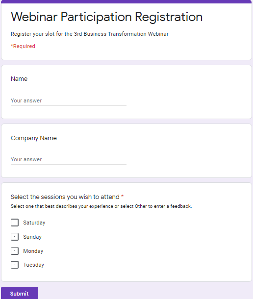

# Google Form Customizer
### Beautify and customize your Google Form with custom HTML and CSS.

<!--   -->

</br>
Original Google Form (left) vs Customized Google Form (right)

___

### Install the package
`npm i custom-gform`

After installing the package, run `npm install` to install all dependencies.

___
### API
| API  | Description |
| ---- | ----------- |
| get | Retrieve all form data in the same order listed
| getByCategory | Retrieve all form data and categorize the questions into its own category (short answers, multiple choice...)

___

### Supported Question Types
   
    0: Short answers
    1: Paragraph
    2: Multiple Choice
    3: Drop Down
    4: Checkboxes  
    5: Linear Scale

___

### Example .get Output

```js
    // Works with both edit and preview link
    const formData = await get("Replace with your Google Form link");

    {
        formTitle: 'Custom G Form',
        formDescription: 'Form Description',
        questions: [ 
            { 
                entry: 'entry.159023240',
                title: 'Multiple choice',
                description: 'MC Description',
                choices: [ [Object], [Object], [Object] ],
                required: false 
            },
            { 
                entry: 'entry.1862994755',
                title: 'Multiple choice',
                description: 'MC Description REQUIRED',
                choices: [ [Object], [Object] ],
                required: true },
            { 
                entry: 'entry.1536591222',
                title: 'Short Answer',
                description: 'Description: REQUIRED',
                required: true 
            }
        ]
    }
```

### Example .getByCategory Output

```js
    // Works with both edit and preview link
    const formData = await getByCategory("Replace with your Google Form link");
    { 
        formAction: 'https://docs.google.com/forms/u/0/d/e/1FAIpQLSeHM3lr79IGiu57NR6lwUMqBZDKsp9C5IpzRApgLfdZX2gwkw/formResponse',
        formTitle: 'Custom G Form',
        formDescription: 'Form Description',
        questions: { 
            shortAnswers: [ [Object], [Object] ],
            paragraphs: [ [Object], [Object] ],
            multipleChoice: [ [Object], [Object] ],
            dropDown: [ [Object] ],
            checkBoxes: [ [Object], [Object] ],
            linearScale: [ [Object] ] 
        } 
    }
```
___
### Return Object Info
| Key  | Description |
| ---- | ----------- |
| formAction | POST api to submit the form response
| entry | Use this in the `name` attribute of each form input 
| required | Check for required form field
___

### Vue + Bootstrap Example
Check out the `examples/vue-bootstrap.vue` folder in GitHub for example usage
___
### Credits
Custom GForm is created and maintained by [Graphicito](http://graphicito.com). For custom web development solution or Google Form customization, contact us at [Contact Graphicito](http://graphicito.com/contact).